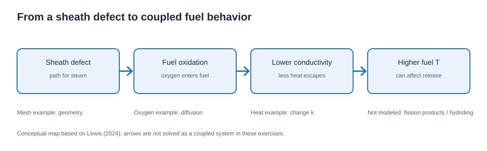
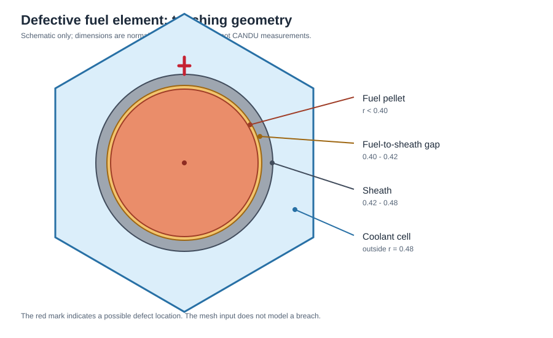
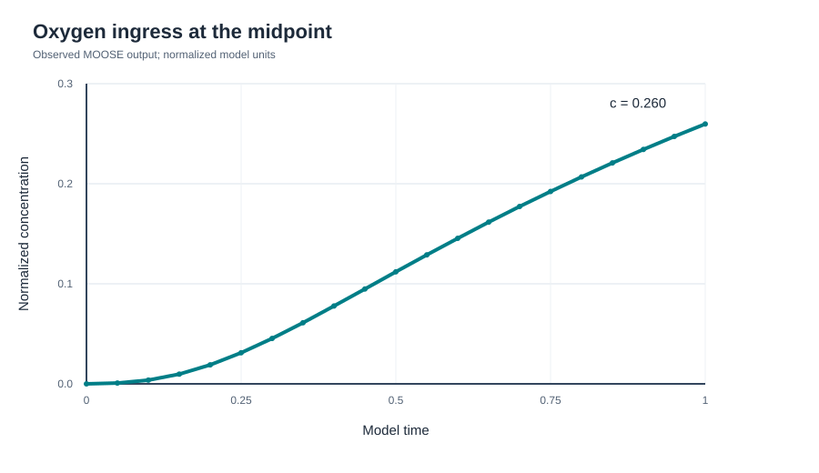

# Detailed report: three introductory MOOSE exercises related to defective CANDU fuel

## Purpose and scope

B. J. Lewis's [2024 paper](https://doi.org/10.1016/j.jnucmat.2023.154877) studies the behavior of defective CANDU fuel using a coupled model. In the research model, coolant entry at a sheath defect can drive fuel oxidation; oxygen transport and fuel stoichiometry affect thermal conductivity and fission product diffusivity; steam and hydrogen in the fuel-to-sheath gap affect the risk of sheath hydriding. The paper's numerical work uses COMSOL. The exercises reported here use MOOSE and deliberately separate three elementary pieces: geometry, steady heat conduction, and transient oxygen diffusion. They support learning rather than quantitative reproduction.

All lengths, coefficients, sources, temperatures, concentrations, and times in the exercises are illustrative. They are not extracted material data or boundary conditions from the paper. The word *defect* describes the physical motivation; these inputs do not mesh a breach or solve coolant entry.

## Environment, source files, and observed runs

The user ran the official prebuilt `idaholab/moose:latest` Docker image from Ubuntu 24.04 under WSL 2 on Windows 11. The source inputs are in [`examples/`](../examples/). The run evidence visible in the user's terminal is summarized below. CSV values are documented in [`data/`](../data/) and their capture method in [`data/PROVENANCE.md`](../data/PROVENANCE.md).

| Exercise | Command inside container | Observed evidence |
| --- | --- | --- |
| Fuel element mesh | `moose-opt -i 01_defective_pin_mesh.i --mesh-only` | Exodus file `01_defective_pin_mesh_in.e` existed; terminal listing showed 9.3 KB |
| Heat conduction | `moose-opt -i 02_conductivity_and_temperature.i` | `center_T = 301.00000000004` at final steady solve step |
| Oxygen ingress | `moose-opt -i 03_oxygen_ingress.i` | `center_c` increased from 0 to `0.25974969442372` by model time 1 |

Run these commands from the repository's `examples/` directory. The original [Exodus mesh](../data/01_defective_pin_mesh_in.e) is included in Git. An Exodus reader such as ParaView can show the element boundaries, but the figure below is a schematic drawn for this report, not an Exodus rendering.

## Exercise 1: fuel, gap, sheath, and coolant mesh

The input uses MOOSE's [`PolygonConcentricCircleMeshGenerator`](https://mooseframework.inl.gov/source/meshgenerators/PolygonConcentricCircleMeshGenerator.html), the same class highlighted in the [Reactor Module geometry tutorial](https://mooseframework.inl.gov/getting_started/examples_and_tutorials/tutorial04_meshing/step05_common_geom.html). The cross-section is a hexagonal computational cell containing concentric rings. Its purpose is to practice assigning named subdomains that could later receive distinct material properties.

| Input entry | Meaning in this exercise |
| --- | --- |
| `num_sides = 6` | The outer computational cell is hexagonal. |
| `num_sectors_per_side = '2 2 2 2 2 2'` | Each hexagon side is split into two azimuthal sectors. |
| `polygon_size = 0.7` | Distance from center to an outer flat side, in illustrative length units. |
| `ring_radii = '0.40 0.42 0.48'` | Interfaces around the pellet, gap, and sheath. |
| `ring_intervals = '2 1 1'` | Radial element counts for the corresponding ring regions. |
| `ring_block_names = 'fuel_center fuel gap sheath'` | Labels assigned from the center outward. Both `fuel_center` and `fuel` represent the pellet. |
| `background_block_names = coolant` | Labels the area between the outer circular ring and hexagon. |
| `preserve_volumes = on` | Adjusts meshed ring geometry to preserve area when the discretization changes. |

The command `--mesh-only` evaluates the `[Mesh]` block and writes an Exodus mesh without requiring variables, equations, or boundary conditions. The observed file listing confirms that the mesh was produced. File existence does **not** by itself establish mesh quality, a physically correct gap width, or a resolved defect region. In particular, the thin gap has only one radial interval; it is an introductory region map.

## Exercise 2: heat generation and conductivity

This exercise replaces the cross-section with a simple 1-D slab, `0 <= x <= 1`. The model asks how a uniform internal source changes temperature when both ends are fixed at 300. Its governing equation is

$$
-\frac{d}{dx}\left(k\frac{dT}{dx}\right)=q,\qquad T(0)=T(1)=300,
$$

with `q = 8` and `k = 1` in normalized units. `GeneratedMeshGenerator` creates 20 line elements; `[Variables]` names the unknown `T`; `MatDiffusion` represents heat conduction; `BodyForce` supplies uniform heating; `GenericConstantMaterial` supplies `k`; and two `DirichletBC` objects hold the end values. `PointValue` samples `T` at `x = 0.5`. The steady executioner solves for a time-independent state. The CSV output records `center_T`.

For this constant-coefficient teaching case, the analytic solution is

$$
T(x)=300+\frac{q}{2k}x(1-x).
$$

At the center, this gives `T(0.5) = 300 + q/(8k) = 301` for `k = 1`. The observed MOOSE result, `301.00000000004`, agrees to displayed numerical precision. The CSV's initial `time = 0, center_T = 0` is a pre-solve value; the final `time = 1` row is a steady solve step, not one second of heating.

The paper discusses reduced fuel thermal conductivity after oxidation. A **proposed follow-up** is to change `prop_values = 1` to `prop_values = 0.5` and rerun. The analytic prediction would be `T(0.5) = 302`. That prediction is not recorded as an observed run in this repository. The example does not compute conductivity from oxygen concentration; the user chooses a constant value manually.

## Exercise 3: oxygen entering from a defect-side boundary

This exercise uses a 1-D path from a defect-side surface (`x = 0`) into fuel (`x = 1`). The concentration `c` starts at 0. The left boundary is held at 1; the right boundary has the default zero-flux condition. The normalized model is

$$
\frac{\partial c}{\partial t}=D\frac{\partial^2 c}{\partial x^2},\qquad
c(x,0)=0,\quad c(0,t)=1,\quad \left.\frac{\partial c}{\partial x}\right|_{x=1}=0,
$$

with `D = 0.1`, 40 line elements, and time steps of 0.05 through model time 1. `TimeDerivative` accounts for accumulation and `MatDiffusion` for spreading. `GenericConstantMaterial` sets `D`; `DirichletBC` maintains concentration at the left boundary; `PointValue` records the midpoint.

The observed midpoint concentration increases monotonically. Selected rows are:

| Model time | Midpoint concentration |
| ---: | ---: |
| 0 | 0 |
| 0.25 | 0.0310721 |
| 0.50 | 0.1119801 |
| 0.75 | 0.1923077 |
| 1.00 | 0.2597497 |

This is a diffusion demonstration. The research paper additionally treats oxygen transport in a temperature gradient (the Soret effect), chemical reaction and changing fuel stoichiometry, gas transport in gaps and cracks, and feedback to thermal and fission product properties. Those processes are absent from this input. The result `0.2597497` is a normalized concentration at one point, not an oxygen-to-metal ratio or a measured fuel oxidation level.

## What the three examples establish

Together the runs demonstrate a practical progression: construct named material regions, solve a simple heat equation, and solve a time-dependent diffusion equation. They show how MOOSE divides geometry into elements, applies physical equations and boundary conditions, and writes data that can be checked against analytical behavior or plotted over time. They do **not** yet constitute a coupled defective-fuel simulation, because the oxygen and temperature exercises use separate meshes and do not exchange data.

For a research-grade extension, one would need measured fuel and sheath dimensions, physical units, oxidation kinetics, oxygen transport including temperature-gradient effects, conductivity and diffusivity as functions of stoichiometry and temperature, fission product production/decay/release, gas-phase gap transport, hydride criteria, appropriate boundary conditions, and validation against experimental data. Mesh and time-step convergence checks would also be necessary. None of those claims can be inferred from the successful teaching runs alone.

## Reproducibility and verification

1. Use the three input files without modifying their normalized example parameters.
2. Run the commands in the repository [README](../README.md) using the installed MOOSE Docker image.
3. Verify that the mesh file is created, heat center temperature is near 301, and oxygen center concentration increases toward 0.25975 at model time 1.
4. Compare the newly generated CSV and Exodus outputs with the originals in `data/`. The schematic figure is illustrative rather than a rendering of the Exodus mesh.

The version tag `latest` can change. For strict scientific reproducibility, record the Docker image digest and MOOSE version used for a future run. The screenshots available for this report did not include those identifiers.

## Sources

- B. J. Lewis, "Modelling of defective CANDU fuel phenomena," *Journal of Nuclear Materials* 590 (2024), 154877. [DOI: 10.1016/j.jnucmat.2023.154877](https://doi.org/10.1016/j.jnucmat.2023.154877).
- MOOSE, [Frequently Used Reactor Geometries and Corresponding Mesh Generators](https://mooseframework.inl.gov/getting_started/examples_and_tutorials/tutorial04_meshing/step05_common_geom.html).
- MOOSE, [Meshing Workflow](https://mooseframework.inl.gov/getting_started/examples_and_tutorials/tutorial04_meshing/step03_workflow.html).
- MOOSE, [Docker image instructions](https://mooseframework.inl.gov/getting_started/installation/docker.html).
- MOOSE, [`MatDiffusion`](https://mooseframework.inl.gov/source/kernels/MatDiffusion.html), [`BodyForce`](https://mooseframework.inl.gov/source/kernels/BodyForce.html), and [transient example](https://mooseframework.inl.gov/modules/optimization/examples/material_transient.html).
